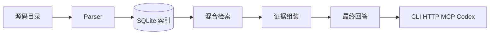

# USES Indexer

`uses-indexer` 是一个面向 USES/UFT DSL 代码库与 `metadata` 元数据目录的本地索引器原型。

当前已经完成两层基础能力：

1. 解析 XML 外壳 + `CDATA` DSL 代码体。
2. 解析 `metadata` 目录下的标准字段、常量、错误号、宏、主题域、缓存表、组件、字典等元数据文件。
3. 把解析结果写入 SQLite，并提供混合检索、问答包、本地 API/回答接口和 MCP 插件入口。

这还不是最终版问答系统，但已经具备了“理解仓库结构并沉淀索引”的第一版基础设施。

## 架构总览

完整架构说明见 [docs/ARCHITECTURE.md](docs/ARCHITECTURE.md)。

相关文档：

- [docs/ARCHITECTURE.md](docs/ARCHITECTURE.md)：看整体分层、数据流和问答链路
- [docs/CALL_SEMANTICS.md](docs/CALL_SEMANTICS.md)：看 `LS/LF/AF` 之间的本地调用与 RPC 调用语义规则
- [docs/DEPLOYMENT.md](docs/DEPLOYMENT.md)：看怎么本地部署、怎么接 HTTP/MCP/Codex
- [docs/USAGE.md](docs/USAGE.md)：看平时该怎么提问、怎么看返回结果
- [docs/INDEX_SCHEMA.md](docs/INDEX_SCHEMA.md)：看 SQLite 里到底存了什么
- [docs/EVALUATION.md](docs/EVALUATION.md)：看评测怎么跑、怎么做 A/B 对比

当前项目可以理解成一条固定链路：

`源码目录 -> 解析 -> SQLite 索引 -> 混合检索 -> 证据组装 -> 问答包 -> 最终回答 -> HTTP/MCP/Codex 接入`



如果你第一次接触这个仓库，建议按下面顺序理解：

1. 先看 [docs/ARCHITECTURE.md](docs/ARCHITECTURE.md) 里的总览图和端到端调用链
2. 再看 [docs/INDEX_SCHEMA.md](docs/INDEX_SCHEMA.md) 理解 SQLite 里到底存了什么
3. 最后用 README 里的 `query-index / assemble-evidence / answer-codebase` 跑一遍真实问题

## 当前已实现

- 解析 `LF / LS / AF / RS` 文件
- 解析 `metadata` 目录下的所有元数据文件，而不是只把它们当普通文本跳过
- 提取文件级元数据
- 提取 `histories / inputParameters / outputParameters / internalParams`
- 提取元数据条目：
  - 标准字段
  - 标准组件与组件字段
  - 业务数据类型 / 标准数据类型 / 默认值
  - 数据字典 / 用户常量 / 标准错误号
  - 系统宏 / 用户宏
  - 主题域 / 业务状态域 / 组播域
  - 缓存表 / 表数据组件 / 标准对象字段
  - 接口结构体 / 用户上下文 / 序列号 / 系统配置
- 提取代码体中的：
  - 注释
  - DSL 动作语句
  - 过程调用
  - `if / else if / else / while / switch`
  - `break / continue / goto`
  - 标签
  - 通用原始代码语句
- 抽取语句中的变量引用与简单写入变量
- 提供 CLI 入口，可对单文件或目录进行解析并输出 JSON
- 提供 SQLite 索引构建能力
- 提供 SQLite FTS + SQL fallback 的混合检索能力
- 提供语义块 `chunk` 切分与 `chunks_fts` 检索能力
- 提供本地哈希向量 `chunk_vectors` 与向量式召回能力
- 提供 OpenAI-compatible embedding 接口接入能力，可替换本地哈希向量
- 提供向量空间兼容校验，避免“用 A 模型建库、用 B 模型查询”导致错误召回
- 提供结构块恢复：事务块、SQL 块、失败处理块、记录循环块
- 提供异常与控制流恢复：`EXCEPTION`、`WHEN_OTHERS`、`goto svr_end`、退出标签
- 提供 SQL 表访问抽取：从 `select/update/delete/insert/merge` 中恢复真实表名
- 提供动态 SQL 恢复：支持从 `@sql_str = "..."`、`sprintf/hs_snprintf/hs_strcpy` 这类字符串构造中还原 SQL 文本
- 提供两跳调用链扩展与重排
- 提供意图感知重排：对表访问、变量赋值、调用链、失败路径等问题使用不同证据权重
- 提供块级关系摘要，使证据能带上“在哪个事务/SQL/失败路径里”
- 提供 Python 层重排能力
- 提供面向问答的证据组装能力，可直接生成 `llm_context`
- 提供一跳关系过程摘要扩展，使证据不只停留在命中过程本身
- 提供本地 `answer-codebase` 回答入口
- 提供本地 HTTP API，包括最终回答接口 `POST /answer`
- 提供本地 stdio MCP server，包括 `db_summary / query_codebase / assemble_evidence / ask_codebase / answer_codebase`
- 提供检索评测命令 `eval-retrieval`，可用固定问题集跟踪检索质量
- 提供评测报告对比命令 `compare-eval`，可比较不同 embedding / 切块 / 重排策略的 A/B 变化
- 提供可安装的 Codex 技能定义 `skills/uses-codebase-search`
- 提供 repo-local Codex 插件定义 `plugins/uses-codebase-plugin`
- 已在完整目录 `/Users/songzuoqiang/Documents/agent/code` 上完成一次全量扫描和索引验证，并保留 `uses_codes` 子库索引用于回归评测
- 已把 `LS/LF/AF` 前缀调用规则正式编码进索引器，用于区分本地函数调用和系统间 RPC 调用
- 已把 `同步消息发布 / 消息发布` + `topic_name` 规则编码进索引器，用于识别消息中心跨核心发布
- 已把 `metadata` 目录正式纳入索引范围，不再只索引 UFT 代码文件
- 已把元数据条目写成 `metadata_item` 语句与语义块，并建立定义、映射、字段包含、宏引用等关系边

## 当前验证结果

### 完整代码根目录索引摘要

当前推荐默认库是完整根目录索引：

- 源码根目录：`/Users/songzuoqiang/Documents/agent/code`
- 索引库：`/Users/songzuoqiang/Documents/agent/condex/codes/examples/agent_code_index.db`
- 文件总数：`21148`
- `procedures`：`21148`
- `statements`：`1122460`
- `chunks`：`201030`
- `chunk_vectors`：`201030`
- `blocks`：`40887`
- `calls_procedure`：`54774`
- `publishes_mc_topic`：`501`
- `local_function_call`：`44486`
- `rpc_call`：`3999`
- `MC async publish`：`313`
- `MC sync publish`：`188`

目录覆盖：

- `uarg_codes`: `4215`
- `ucbp_codes`: `4300`
- `uconvert_codes`: `559`
- `ucrt_codes`: `1649`
- `umgr_codes`: `2951`
- `uopt_codes`: `542`
- `upub_codes`: `677`
- `uqms_codes`: `720`
- `uref_codes`: `1358`
- `uses_codes`: `2564`
- `usms_codes`: `1613`

摘要文件：

- `examples/agent_code_index_summary.json`
- `examples/agent_code_db_summary.json`
- `examples/agent_code_mc_publish_example.json`

说明：

- 这个完整根目录库现在是 CLI、HTTP API、MCP、Codex skill/plugin 的推荐默认库
- 这个完整根目录库现在同时覆盖业务 DSL 文件和 `metadata` 目录里的元数据文件
- `examples/uses_codes_index.db` 继续保留，用于更小范围的评测和回归验证

### uses_codes 子库解析层摘要

基于完整代码目录的当前扫描结果：

- 文件总数：`2564`
- `Function`：`1858`
- `Service`：`703`
- `FactorService`：`3`
- 语句统计：
  - `action`: `18140`
  - `call`: `8085`
  - `control`: `22026`
  - `assignment`: `23673`
  - `comment`: `33196`

摘要文件：

- `examples/uses_codes_summary.json`

### SQLite 索引摘要

- `files`: `2564`
- `procedures`: `2564`
- `histories`: `7380`
- `params`: `70004`
- `statements`: `159148`
- `actions`: `26225`
- `variable_refs`: `214948`
- `edges`: `62645`
- `chunks`: 由建库时按过程语义块自动生成
- `chunk_vectors`: 与 `chunks` 一一对应
- `blocks`: 由建库时按事务 / SQL / 失败处理 / 循环等稳定结构恢复生成
- `block_edges`: 聚合块内部的过程调用、表访问和控制流关系
- `procedures_fts`: `2564`
- `statements_fts`: `159148`
- `actions_fts`: `26225`
- `edges_fts`: `62645`
- `chunks_fts`: 与 `chunks` 一一对应
- `blocks_fts`: 与 `blocks` 一一对应

摘要文件：

- `examples/uses_codes_index_summary.json`
- `examples/uses_codes_db_summary.json`
- `examples/uses_codes_evidence_example.json`
- `examples/uses_codes_qa_example.json`
- `examples/uses_codes_answer_example.json`
- `examples/uses_codes_failure_flow_example.json`
- `examples/uses_codes_exit_flow_example.json`
- `examples/uses_codes_sql_table_example.json`
- `examples/uses_codes_call_chain_example.json`
- `examples/uses_codes_dynamic_sql_example.json`
- `examples/uses_codes_intent_rerank_example.json`
- `examples/uses_codes_eval_report.json`
- `examples/uses_codes_eval_report_local_hash.json`
- `examples/uses_codes_eval_compare.json`
- `examples/uses_codes_embedding_smoke.json`
- `examples/uses_codes_embedding_e2e_report.json`
- `examples/uses_codes_eval_report_subset_local_hash.json`
- `examples/uses_codes_eval_report_real_embedding_subset.json`
- `examples/uses_codes_eval_compare_real_embedding_subset.json`
- `examples/uses_codes_embedding_medium_benchmark.json`
- `examples/uses_codes_index_real_embedding_medium_summary.json`

### 检索评测摘要

当前初始评测集位于 `eval/uses_codes_cases.json`，覆盖动态 SQL 表写入、错误码报错、表读取、过程调用引用和变量 SQL 执行等场景。

当前样例报告：

- `examples/uses_codes_eval_report.json`
- `examples/uses_codes_eval_report_local_hash.json`
- `pass@1`: `1.0`
- `pass@3`: `1.0`
- `pass@5`: `1.0`
- `pass@10`: `1.0`
- `expectation_recall@10`: `0.9`
- 当前自比较样例 `examples/uses_codes_eval_compare.json` 中 `improved/regressed` 都是 `0`，用于展示报告格式

本地默认库发现现在会优先使用 `examples/agent_code_index.db`，如果不存在，再回退到 `examples/uses_codes_index.db`。这两个数据库文件体积都较大，当前都不纳入版本控制。

## Embedding 配置

默认情况下，索引器会使用本地零依赖的 `LocalHashedEmbedder`。

如果你希望用真实语义 embedding，可以设置：

- `USES_INDEXER_EMBEDDING_API_KEY`
- `USES_INDEXER_EMBEDDING_MODEL`
- `USES_INDEXER_EMBEDDING_BASE_URL`
- `USES_INDEXER_EMBEDDING_BATCH_SIZE`
- `USES_INDEXER_EMBEDDING_DIMENSIONS`
- `USES_INDEXER_EMBEDDING_TIMEOUT`
- `USES_INDEXER_EMBEDDING_CACHE_DB`

也兼容当前常见的 OpenAI embedding 专用变量名：

- `OPENAI_EMBEDDING_KEY`
- `OPENAI_EMBEDDING_NAME` 或 `OPENAI_EMBEDDING_MODEL`
- `OPENAI_EMBEDDING_URL`
- `OPENAI_EMBEDDING_BATCH_SIZE`
- `OPENAI_EMBEDDING_DIMENSIONS`
- `OPENAI_EMBEDDING_TIMEOUT`
- `OPENAI_EMBEDDING_CACHE_DB`

示例：

```bash
export OPENAI_EMBEDDING_KEY="..."
export OPENAI_EMBEDDING_URL="https://oapi.aivue.cn/v1"
export OPENAI_EMBEDDING_NAME="text-embedding-3-large"
export OPENAI_EMBEDDING_BATCH_SIZE=16
export OPENAI_EMBEDDING_TIMEOUT=60
export OPENAI_EMBEDDING_CACHE_DB="/Users/songzuoqiang/Documents/agent/condex/codes/examples/agent_code_embedding_cache.db"

PYTHONPATH=src python3 -m uses_indexer build-index \
  /Users/songzuoqiang/Documents/agent/code \
  --db /Users/songzuoqiang/Documents/agent/condex/codes/examples/agent_code_index_openai.db
```

如果外部 embedding 建库中途失败或被中断，可以复用同一个缓存和索引库续建缺失向量：

```bash
PYTHONPATH=src python3 -m uses_indexer build-index \
  /Users/songzuoqiang/Documents/agent/code \
  --db /Users/songzuoqiang/Documents/agent/condex/codes/examples/agent_code_index_openai.db \
  --resume-vectors
```

`OPENAI_EMBEDDING_URL` 可以填到 `/v1`，索引器会自动补成 `/v1/embeddings`。

兼容规则：

- 建库会先写入 `files / procedures / statements / chunks`，再全局批量补齐缺失的 `chunk_vectors`
- 每完成一个向量 batch 就会提交事务，降低长时间建库中断后的损失
- 建库时会把 `provider / model / dimension` 写入 SQLite 元数据
- 查询时会校验当前 embedding 配置是否和索引库一致
- 如果不一致，会自动禁用向量召回，并在返回结果里输出 `vector_status`
- 如果切换了 embedding 模型，应该重新执行一次 `build-index`
- 如果配置了 `*_EMBEDDING_CACHE_DB`，外部 embedding 会先查本地 SQLite 缓存，未命中才请求接口；缓存文件建议放在 `examples/*.db` 或其他不纳入版本控制的位置
- `--resume-vectors` 只补齐已有索引库中缺失的向量，会自动跳过已经存在的 `chunk_vectors`

## 目录结构

```text
.agents/
  plugins/marketplace.json
docs/
  ARCHITECTURE.md
  DEPLOYMENT.md
  EVALUATION.md
  INDEX_SCHEMA.md
  USAGE.md
  WORKLOG.md
eval/
  uses_codes_cases.json
examples/
  uses_codes_summary.json
  uses_codes_index_summary.json
  uses_codes_db_summary.json
  uses_codes_evidence_example.json
  uses_codes_qa_example.json
  uses_codes_answer_example.json
  uses_codes_failure_flow_example.json
  uses_codes_exit_flow_example.json
  uses_codes_sql_table_example.json
  uses_codes_call_chain_example.json
  uses_codes_dynamic_sql_example.json
  uses_codes_intent_rerank_example.json
  uses_codes_eval_report.json
  uses_codes_eval_compare.json
plugins/
  uses-codebase-plugin/
    .codex-plugin/plugin.json
    .mcp.json
    scripts/run_mcp_server.py
    skills/uses-codebase-search/SKILL.md
skills/
  uses-codebase-search/
    SKILL.md
src/uses_indexer/
  api.py
  answering.py
  embeddings.py
  evaluation.py
  __init__.py
  __main__.py
  cli.py
  indexer.py
  llm.py
  mcp_server.py
  models.py
  parser.py
  qa.py
tests/
  test_api.py
  test_answering.py
  test_mcp.py
  test_parser.py
  test_indexer.py
  test_qa.py
```

## 快速开始

安装：

```bash
cd /Users/songzuoqiang/Documents/agent/condex/codes
python3 -m pip install -e .
```

解析单文件：

```bash
python3 -m uses_indexer parse-file \
  /Users/songzuoqiang/Documents/agent/code/uses_codes/uftbusiness/customization/sesextmgt/LF_SESEXTMGR_BJSREALTIME_QRY.uftfunction
```

扫描目录并输出解析摘要：

```bash
python3 -m uses_indexer scan-dir \
  /Users/songzuoqiang/Documents/agent/code \
  --limit 20 \
  --output /Users/songzuoqiang/Documents/agent/condex/codes/examples/agent_code_summary.json
```

构建 SQLite 索引：

```bash
python3 -m uses_indexer build-index \
  /Users/songzuoqiang/Documents/agent/code \
  --db /Users/songzuoqiang/Documents/agent/condex/codes/examples/agent_code_index.db \
  --output /Users/songzuoqiang/Documents/agent/condex/codes/examples/agent_code_index_summary.json
```

只补齐已有索引库中缺失的向量：

```bash
python3 -m uses_indexer build-index \
  /Users/songzuoqiang/Documents/agent/code \
  --db /Users/songzuoqiang/Documents/agent/condex/codes/examples/agent_code_index.db \
  --resume-vectors
```

查看数据库摘要：

```bash
python3 -m uses_indexer db-summary \
  --db /Users/songzuoqiang/Documents/agent/condex/codes/examples/agent_code_index.db \
  --output /Users/songzuoqiang/Documents/agent/condex/codes/examples/agent_code_db_summary.json
```

执行简单关键词查询：

```bash
python3 -m uses_indexer query-index \
  --db /Users/songzuoqiang/Documents/agent/condex/codes/examples/agent_code_index.db \
  --query "证券代码获取" \
  --limit 10
```

运行检索评测：

```bash
python3 -m uses_indexer eval-retrieval \
  --db /Users/songzuoqiang/Documents/agent/condex/codes/examples/uses_codes_index.db \
  --cases /Users/songzuoqiang/Documents/agent/condex/codes/eval/uses_codes_cases.json \
  --limit 10 \
  --top-k 1,3,5,10 \
  --output /Users/songzuoqiang/Documents/agent/condex/codes/examples/uses_codes_eval_report.json
```

这个命令会输出：

- 每个问题的 top hits
- `pass@k`
- `expectation_recall@k`
- 首个相关命中的排名
- 未命中的期望项，方便后续继续调检索规则

对比两份评测报告：

```bash
python3 -m uses_indexer compare-eval \
  --before /Users/songzuoqiang/Documents/agent/condex/codes/examples/uses_codes_eval_report.json \
  --after /Users/songzuoqiang/Documents/agent/condex/codes/examples/uses_codes_eval_report.json \
  --output /Users/songzuoqiang/Documents/agent/condex/codes/examples/uses_codes_eval_compare.json
```

这个命令会输出：

- 汇总指标 delta
- 每个 case 的 `improved / regressed / unchanged / added / removed`
- before / after 的首个命中排名、召回率和 top hit

组装可直接给大模型使用的证据上下文：

```bash
python3 -m uses_indexer assemble-evidence \
  --db /Users/songzuoqiang/Documents/agent/condex/codes/examples/agent_code_index.db \
  --query "证券代码获取的逻辑在哪里" \
  --limit 6 \
  --context-window 2 \
  --related-limit 3 \
  --output /Users/songzuoqiang/Documents/agent/condex/codes/examples/agent_code_evidence_example.json
```

这个命令会返回：

- 重排后的证据块
- 语义块命中及其摘要
- 向量式召回命中
- 向量兼容状态 `vector_status`
- 覆盖当前证据的事务块 / SQL 块 / 失败处理块摘要
- 覆盖当前证据的异常处理块和退出跳转摘要
- 每个证据块对应的代码片段
- 相关调用、来路调用、表访问
- 一跳关联过程的摘要
- 一段可直接交给 LLM 的 `llm_context`

生成完整的问答包：

```bash
python3 -m uses_indexer ask-codebase \
  --db /Users/songzuoqiang/Documents/agent/condex/codes/examples/agent_code_index.db \
  --question "证券代码获取的逻辑在哪里" \
  --evidence-limit 6 \
  --context-window 2 \
  --related-limit 3
```

这个命令会返回：

- 检索到的证据块
- 标准化 `system_prompt`
- 可直接发给模型的 `user_prompt`
- 一个本地生成的 `draft_answer`
- 支撑结论的文件路径和行号

生成最终回答：

```bash
python3 -m uses_indexer answer-codebase \
  --db /Users/songzuoqiang/Documents/agent/condex/codes/examples/agent_code_index.db \
  --question "证券代码获取的逻辑在哪里" \
  --evidence-limit 6 \
  --context-window 2 \
  --related-limit 3 \
  --output /Users/songzuoqiang/Documents/agent/condex/codes/examples/agent_code_answer_example.json
```

当前行为：

- 如果配置了外部模型，会优先调用模型生成最终回答
- 如果没有配置外部模型，会回退到基于证据生成的 `draft_answer`
- 返回字段里会标明 `answer_source`

如果你还配置了外部 embedding：

- 建库会优先使用外部 embedding 生成 `chunk_vectors`
- 查询会优先使用相同 embedding 空间做块级向量召回
- 如果查询端和索引端 embedding 不兼容，会自动降级到 `FTS + LIKE + rerank`

启动本地 HTTP API：

```bash
python3 -m uses_indexer serve-api \
  --db /Users/songzuoqiang/Documents/agent/condex/codes/examples/agent_code_index.db \
  --host 127.0.0.1 \
  --port 8000
```

可用接口：

- `GET /health`
- `GET /db-summary`
- `POST /query`
- `POST /evidence`
- `POST /ask`
- `POST /answer`

示例：

```bash
curl -s http://127.0.0.1:8000/health
```

```bash
curl -s http://127.0.0.1:8000/ask \
  -H 'Content-Type: application/json' \
  -d '{"question":"证券代码获取的逻辑在哪里","evidence_limit":3}'
```

```bash
curl -s http://127.0.0.1:8000/answer \
  -H 'Content-Type: application/json' \
  -d '{"question":"证券代码获取的逻辑在哪里","evidence_limit":3}'
```

启动本地 stdio MCP server：

```bash
python3 -m uses_indexer serve-mcp \
  --db /Users/songzuoqiang/Documents/agent/condex/codes/examples/agent_code_index.db
```

可用 MCP 工具：

- `db_summary`
- `query_codebase`
- `assemble_evidence`
- `ask_codebase`
- `answer_codebase`

如果你想把它作为 Codex 的 repo-local 插件使用，仓库里已经包含：

- `plugins/uses-codebase-plugin/.codex-plugin/plugin.json`
- `plugins/uses-codebase-plugin/.mcp.json`
- `.agents/plugins/marketplace.json`

插件默认会启动：

```bash
python3 ./scripts/run_mcp_server.py
```

默认索引库是：

- `/Users/songzuoqiang/Documents/agent/condex/codes/examples/agent_code_index.db`

如果需要切换索引库，可以传：

```bash
python3 ./scripts/run_mcp_server.py --db /absolute/path/to/your.db
```

当前检索默认是混合式的：

- `FTS`
- `chunk` 块级召回
- `vector_chunk` 本地哈希向量召回
- SQL fallback
- Python 重排

把 repo-local plugin 和技能安装到本机 Codex：

```bash
python3 -m uses_indexer install-codex-integration
```

这个命令会：

- 在 `~/plugins/uses-codebase-plugin` 创建指向仓库插件目录的符号链接
- 在 `~/.codex/skills/uses-codebase-search` 创建指向仓库技能目录的符号链接
- 在 `~/.agents/plugins/marketplace.json` 写入本地插件入口

如果本地已有同名目标，需要显式覆盖：

```bash
python3 -m uses_indexer install-codex-integration --force
```

## 外部模型配置

`answer-codebase` 和 `POST /answer` 支持一个 OpenAI-compatible 的聊天接口，使用这些环境变量：

- `USES_INDEXER_LLM_API_KEY`
- `USES_INDEXER_LLM_MODEL`
- `USES_INDEXER_LLM_BASE_URL`
- `USES_INDEXER_LLM_TEMPERATURE`
- `USES_INDEXER_LLM_MAX_TOKENS`

如果只设置了 `OPENAI_API_KEY`，仍然需要显式设置 `USES_INDEXER_LLM_MODEL`。

## 技能安装

仓库里已经包含技能定义：

- `skills/uses-codebase-search/SKILL.md`

我还已经把它安装到：

- `/Users/songzuoqiang/.codex/skills/uses-codebase-search/SKILL.md`

重启 Codex 后，这个技能就可以作为本地技能参与后续对话。技能会优先调用本地 MCP 工具，在 MCP 不可用时再回退到本地 `uses-indexer` API。

## 下一步

- 增加更稳定的块级 AST
- 补齐事务块、异常块、SQL 块的配对关系
- 增加更强语义的 embedding / 向量索引
- 增加更精细的表访问与过程关系
- 增加更丰富的模型适配器
- 增加更强的 MCP 能力和更细粒度的工具
