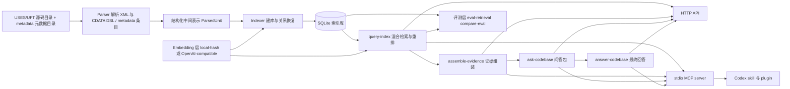
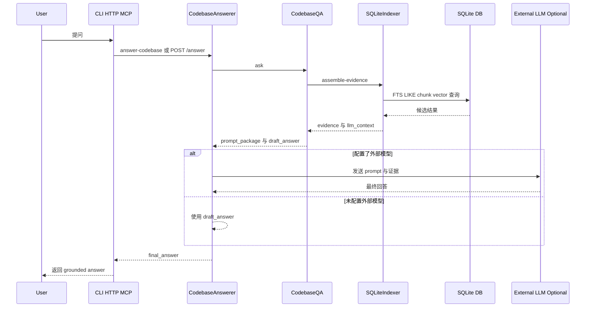

# Architecture

## 目标

这个项目面向 `/Users/songzuoqiang/Documents/agent/code` 这样的完整 UFT/USES DSL 代码根目录，也兼容 `uses_codes` 这类单独子目录。

当前输入源不再只有业务 DSL 文件，还包括各核心 `metadata` 目录下的标准字段、常量、错误号、宏、主题域、缓存表、组件、字典等元数据文件。

第一阶段目标不是“直接问答”，而是先建立一个可靠的解析层，让后续索引和问答建立在结构化数据上。

## 当前阶段范围

当前版本已经做到：

- 识别文件类型：`LF / LS / AF / RS / EI`
- 解析 XML 元信息
- 解析 `CDATA` 中的 DSL 代码体
- 解析 `metadata` 目录中的元数据文件与条目级对象
- 产出统一的 JSON 结构
- 把解析结果落入 SQLite
- 提供 SQLite FTS
- 提供混合检索、重排和证据组装
- 提供语义块切分与块级 FTS
- 提供本地哈希向量与向量式召回
- 提供 OpenAI-compatible embedding 接口接入
- 提供索引端与查询端的向量空间兼容校验
- 提供事务块 / SQL 块 / 失败处理块 / 循环块恢复
- 提供异常块和退出标签恢复
- 提供 SQL 表访问抽取
- 提供动态 SQL 字符串恢复
- 提供基于过程前缀的调用语义分类：
  - `LS -> AF`
  - `LS -> LF`
  - `LF -> LF`
  - `LF -> AF`
  - 视为本地函数调用
  - `LS -> LS`
  - `LF -> LS`
  - `AF -> LS`
  - 视为系统间 RPC 调用
- 提供消息中心主题发布语义分类：
  - `[同步消息发布][topic_name = ...]`
  - `[消息发布][topic_name = ...]`
  - 视为消息中心跨核心发布
- 提供两跳调用链扩展与重排
- 提供意图感知重排
- 提供关系型直连召回：
  - 调用边 `calls_procedure`
  - 表访问边 `reads_table / writes_table / reads_dynamic_table / writes_dynamic_table`
  - 变量写入边 `writes_variable`
  - 失败处理块 `failure_handler / exception_handler / when_others_handler`
- 提供块级关系摘要
- 提供本地 HTTP API
- 提供最终回答层
- 提供 stdio MCP server
- 提供 repo-local Codex 插件封装
- 提供检索评测闭环
- 提供增量建库执行分流：
  - 结构变更走完整重建
  - metadata-only 变更只刷新文件与过程元信息

当前版本还没有做到：

- 完整编译器级 AST
- 精确块嵌套恢复
- 深层事务块 / SQL 块 / 异常块恢复
- 更精确的跨过程关系图

## 一图总览

这个图表达的不是“未来设想”，而是当前仓库已经落地的结构：

- 左侧是源码输入与解析建库链路
- 中间是 SQLite 索引、embedding 与混合检索核心
- 右侧是问答输出、HTTP 服务、MCP 与 Codex 接入层
- 下方是独立的评测闭环，用于验证每次检索调优是否真的变好

当前检索已经不是“只靠 FTS + 向量 + 模糊 rerank”的单一路径，而是更偏多路召回：

- FTS：块、chunk、过程、动作、语句、边
- 向量：chunk embedding 相似度召回
- 关系召回：
  - 过程摘要特征
  - 调用边
  - 显式过程对的最短调用路径桥接
  - 表访问边
  - 变量写入边
  - 失败处理块
  - 一跳邻居上下文过程
  - 受控多跳链路上下文
- rerank：
  - query type 感知
  - feature flag 感知
  - 调用链邻居加权
  - 显式路径桥接优先级
  - 表访问链 / 变量传递链的 focus-chain 加权
  - 过程画像特征加权

知识构建层现在还会在建库结束后做一次全局的 `procedure_features` 刷新：

- 先按文件写入语句、边、chunk、block
- 再统一重算所有过程的：
  - `incoming_callers`
  - `outgoing_calls`
  - `call_fan_in / call_fan_out`
  - `is_call_bridge`
  - 过程级摘要文本

这样像“桥接过程”“被谁调用”这类跨文件语义，不会再因为文件处理顺序不同而漂移。

同一层里，失败路径相关的过程级知识也开始显式沉淀：

- `failure_handler_count`
- `exception_handler_count`
- `when_others_handler_count`
- `has_failure_handlers`

并且会进入 `procedure_features.summary_text`，所以失败题后续不只靠块级命中，还可以直接利用过程级失败语义。

最新一轮知识构建又把 `procedure_features` 从“文本摘要”继续推进成了“结构化过程画像”：

- `profile_json`
  - `primary_inputs`
  - `primary_outputs`
  - `core_calls`
  - `core_callers`
  - `core_read_tables`
  - `core_write_tables`
  - `core_variable_writes`
  - `dynamic_tables`
  - `call_role`
  - `table_access_role`
  - `topic_role`
  - `metadata_role`

这样后续的检索、rerank 和问答都不需要只靠运行时临时拼装文本，而是可以直接消费更稳定的结构化知识。

为了避免增量建库每次都全量重算所有过程摘要，现在增量路径也开始做“局部过程画像刷新”：

- 只刷新 changed / added / metadata-only 文件对应的过程
- 同时补刷新它们的一跳 caller / callee 邻居
- 全量建库仍然保留最终的全局 refresh，确保跨文件语义一致

这让“知识构建”从单纯的索引写入，进一步演进成了更明确的知识底座维护过程。

在检索层，当前已经不只是过程对的调用链桥接：

- `relation_path_bridge`
  - 显式两过程最短调用路径桥接
- `relation_table_chain_context`
  - 以表访问命中为 seed，反向补调用链上下文
- `relation_variable_chain_context`
  - 以变量写入命中为 seed，反向补变量传递链上下文

同时，query type 也继续细化，不再只停留在通用 call chain：

- `implementation_location`
- `callers`
- `callees`
- `table_read`
- `table_write`
- `table_access`
- `variable_write`
- `variable_read`
- `variable_flow`
- `metadata_definition`
- `topic_publish`

这类更细的分类会直接影响：

- 召回时选择哪路关系扩展
- rerank 时加哪些 feature bonus
- QA 时优先暴露哪类 summary hints

问答链路也开始显式利用过程画像，而不是只依赖 evidence excerpt：

- 表问题优先输出：
  - `核心表访问包括 ...`
- 变量问题优先输出：
  - `主要变量写入包括 ...`
- metadata / topic 问题优先输出角色型 hints

并且 `secondary_candidates` 也开始做稳定去重，避免同一过程被多路召回后在草答里重复出现。

最新一轮又把“query type -> rerank -> draft answer”这一条链路对齐得更紧：

- rerank 不再只看 feature flags
  - 也会直接读取 `procedure_profile`
  - 对表问题做 `profile_exact_table_focus`
  - 对变量问题做 `profile_exact_variable_focus`
  - 对调用链问题做 `profile_exact_caller_focus / profile_exact_callee_focus`
- QA 草答不再把所有问题都塞进同一类标题
  - `上游调用`
  - `下游调用`
  - `表写入 / 表读取 / 表访问`
  - `变量写入 / 变量读取 / 变量链路`
  - `Metadata 定义`
  - `Topic 发布`
- 候选判定也开始结合主次候选分差做轻量置信度修正
  - 主候选明显领先时，提高可信度
  - 多个候选分数咬得很近时，主动更保守

再往前一层，过程画像本身也不再只覆盖“表 / 变量 / 调用”：

- `core_topics`
- `core_metadata_refs`

这意味着：

- topic 发布类问题不再只依赖 action/edge 文本命中
- metadata 定义类问题也开始具备可复用的过程级画像

同时，evidence 组装阶段现在会对缺失画像的候选做一次按 `procedure_id` 的回表补齐，所以像 `fts_chunk`、`fts_action` 这类命中，也能把 `procedure_profile` 稳定带进后续 QA 和前端调试视图。

主候选 / 次候选的确定方式也开始从“哪条 evidence 排第一”升级成“过程级聚合判定”：

- 按 `procedure_name + file_path` 聚合多个 evidence
- 汇总 `aggregate_score`
- 合并 `matched_via`
- 选择该过程里分数最高的 evidence 作为代表位置

这样问答层给出的主候选，更像是“当前系统认为最值得相信的过程”，而不只是“恰好排第一的那条片段”。

现在这个“过程级聚合”也开始前移到检索层本身：

- `retrieve_candidates()` 在进入 rerank 前，会先补齐缺失的 `procedure_profile`
- 即使候选来自：
  - `fts_chunk`
  - `fts_action`
  - `fts_statement`
  - `vector_chunk`
  - 其他不直接联表 `procedure_features` 的路径
- 最终也能稳定带上过程画像

随后检索层会再做一次“过程级聚合加权”：

- 按 `procedure_name + file_path` 统计：
  - `aggregate_score`
  - `aggregate_hit_count`
  - `matched_via`
- 对 `topic / metadata / table / variable` 这几类正向问题：
  - 同一过程多路命中会得到适度的 `procedure_aggregate_bonus`
- 这样同一过程被多条 chunk/action/edge 同时支撑时，排序会更稳定，而不会被零碎片段互相稀释

这个设计的目标不是“压制细粒度 evidence”，而是让：

- 精确命中仍然优先
- 多路一致支撑的过程获得稳定加权
- 前端与调试接口能直接看到 `aggregate_score / aggregate_hit_count`

在此基础上，topic / metadata 这两类问题又继续做了更细的专属配方：

- rerank 现在会对以下路径做轻量额外加权：
  - metadata 问题：
    - `fts_procedure_feature`
    - `fts_edge`
  - topic 问题：
    - `fts_procedure_feature`
    - `fts_action`
    - `fts_edge`
- 同时也会显式读取画像中的：
  - `core_topics`
  - `core_metadata_refs`

因此这两类问题不再只是“命中了相关文本”，而是更偏：

- 命中了相关文本
- 且对应过程真的具备该 topic / metadata 画像

evidence 选择层也开始跟上这个策略：

- `topic_publish / metadata_definition` 默认会把同一过程的 evidence cap 收紧到 `1`
- 选出来的 evidence block 会直接携带：
  - `aggregate_score`
  - `aggregate_hit_count`
  - `procedure_profile`

这样最终给到 QA / LLM / 前端的证据面会更干净，不再被同一过程的多条相似片段占满。

在此基础上，evidence 选择本身也开始按 query type 做“块级偏好”排序，而不是只吃 retrieval 的总分：

- 表问题优先偏好：
  - `feature_table_access_chunk`
  - `relation_table_edge`
  - `relation_table_chain_context`
- 变量问题优先偏好：
  - `variable_flow`
  - `relation_variable_edge`
  - `relation_variable_chain_context`
- 调用链问题优先偏好：
  - `call_chain`
  - `relation_path_bridge`
  - `relation_multi_hop_context`
- topic / metadata 问题优先偏好：
  - `fts_procedure_feature`
  - `fts_action`
  - `fts_edge`

这层排序不替代 retrieval 的主排序，而是作为 evidence assembly 的二次收口：

- 先保证主候选过程已经找对
- 再尽量让“交给用户看的第一块证据”更贴近问题类型

所以现在表问题的首证据，不一定名称上必须叫 `table_access`，但会更稳定地携带：

- 表访问相关 reasons
- 表访问角色画像
- 相关 SQL/recovered block 关系

这比单纯追求某个 chunk 名字更稳，也更接近用户真正需要的证据质量。

最新一轮又把“问题类型识别”和“问题类型摘要模板”继续收紧了一层：

- `topic_publish` 的意图识别不再被常量名里的 `mc` 误触发
  - 只有显式出现：
    - `topic`
    - `消息`
    - `发布`
    - `消息中心`
    - `主题`
  - 或 token 级单独出现 `mc`
  - 才会进入 topic 问题
- 这样像 `CNST_MC_UFT_OPTSYNC metadata 定义` 这类问题，不会再被错误分进 topic

与此同时，table / variable / metadata / topic 的专属精排也继续细化：

- 表问题：
  - `intent_table_feature_source`
- 变量问题：
  - `intent_variable_feature_source`
- metadata 问题：
  - `intent_metadata_feature_source`
  - `feature_metadata_profile`
- topic 问题：
  - `intent_topic_feature_source`
  - `feature_topic_profile`

QA 层也开始把这些差异显式体现在首句摘要里，而不是都说成“实现位置”：

- `最关键的表访问过程`
- `最关键的变量链路过程`
- `最关键的 metadata 定义过程`
- `最关键的 topic 发布过程`

这让“问题分类 -> 检索加权 -> 证据选择 -> 草答表述”四层开始更像一条统一的产品链路，而不是四段各自独立的规则。

## 端到端问答链路

这条链路说明当前系统的核心设计取舍：

- 外部模型不是直接看仓库，而是只看索引层筛选出来的证据
- `draft_answer` 始终存在，所以即使没有外部模型也能完成一次可解释回答
- CLI、HTTP API、MCP 只是不同入口，底层复用的是同一套索引与问答逻辑

当前回答层已经不只是“把 evidence 原样丢给模型”。它还有两层约束：

- 证据压缩会按 `query_type` 优先保留更直接的证据
  - 变量问题优先赋值语句
  - 表访问问题优先表边和 SQL 块
  - 失败路径问题优先失败处理块
  - 调用链问题优先直连调用边
- grounded answer 会显式区分：
  - `primary_candidate`
  - `secondary_candidates`
  - `citations`
  - `uncertainties`

对失败路径问题，草答现在也会额外提取：

- 恢复出来的 `failure_handler / exception_handler / when_others_handler`
- 更明确的失败处理块摘要

这样回答“失败在哪里处理”这类问题时，不再只是命中某段代码，而是会更稳定地指出异常处理结构。

另外，证据层现在也不再简单丢弃“同一上下文的重复命中”：

- 如果某个过程片段同时被：
  - FTS
  - 关系桥接
  - 其他关系召回
  命中
- 证据组装会把这些附加命中来源和 reason 合并回同一个 evidence block

这样做的目的不是增加证据数量，而是让：

- 精确路径桥接
- 表/变量关系边
- 其他辅助召回

不会因为上下文去重而在问答阶段丢掉。

另外，回答层现在还有低置信度降级机制：

- 如果 draft confidence 低于阈值
- 且策略允许 `prefer_guarded_draft_on_low_confidence`
- 系统会直接返回 `guarded_draft`

这类结果的特征是：

- `tier = guarded_low_confidence`
- `review_required = true`
- 明确提示“当前证据不足”

目标不是把弱证据问题答得更像，而是让不确定性暴露得更稳定。

## 运行形态

当前项目支持 4 种运行形态：

- 离线建库：`build-index`、`db-summary`、`eval-retrieval`
- 本地查询：`query-index`、`assemble-evidence`、`ask-codebase`
- 本地服务：`serve-api`
- 对话式工具接入：`serve-mcp`、Codex skill、repo-local plugin

这 4 种形态共用一套核心模块，没有额外的“第二套服务实现”。

当前增量建库不再只是“找到 changed files 然后全部删重建”。它已经有两层执行判断：

- `reindexed`
  - 代码语句或过程结构发生变化
  - 需要重建 statements / actions / chunks / blocks / edges / procedure_features
- `metadata_only`
  - 代码语句指纹不变，过程签名不变
  - 只刷新 `files / procedures / procedures_fts / histories / params`
  - 不触发结构块和向量重建

在这个基础上，增量建库现在还支持 `noop` 快速返回：

- 如果本轮没有 `added / changed / removed`
- 直接返回已有索引概况和空执行计划
- 不触发 parser
- 不触发结构重建
- 不触发向量补齐

向量补齐阶段也已经从“逐条写入 `chunk_vectors`”切到“按 batch 组装后 `executemany()` 批量写入”，这样更适合后续较大的索引库。

除此之外，`indexed_files` 的状态回写也不再要求重新 parse 所有未变化文件：

- changed / added 文件会重新计算：
  - `fingerprint`
  - `code_fingerprint`
  - `unit_signature`
- unchanged 文件直接复用上一次存量状态

这意味着当前增量建库的开销已经进一步压缩到：

- 变化检测
- 真正需要重建或刷新的文件
- 必要的向量补齐

而不是在“状态写回”这一步又把整库文件重新扫一遍。

## 模块职责与源码映射

| 层级 | 主要职责 | 对应文件 |
| --- | --- | --- |
| 解析层 | 解析 XML 外壳、CDATA DSL、语句流、参数与元信息 | `src/uses_indexer/parser.py` |
| 索引层 | 建库、写入 SQLite、恢复关系、切块、块恢复、向量入库 | `src/uses_indexer/indexer.py` |
| Embedding 层 | 本地 hash 向量、外部 embedding、缓存与兼容校验 | `src/uses_indexer/embeddings.py` |
| 问答包层 | 生成 `system_prompt`、`user_prompt`、`draft_answer` | `src/uses_indexer/qa.py` |
| 回答层 | 调用外部模型或回退到 `draft_answer` | `src/uses_indexer/answering.py`, `src/uses_indexer/llm.py` |
| HTTP 层 | 暴露 `/query /evidence /ask /answer` | `src/uses_indexer/api.py` |
| MCP 层 | 暴露 `query_codebase / assemble_evidence / answer_codebase` 等工具 | `src/uses_indexer/mcp_server.py` |
| CLI 层 | 命令行入口与参数编排 | `src/uses_indexer/cli.py` |
| 评测层 | 检索评测与 A/B 对比 | `src/uses_indexer/evaluation.py` |
| 集成层 | 安装 Codex skill 与 plugin | `src/uses_indexer/integration.py`, `plugins/uses-codebase-plugin/`, `skills/uses-codebase-search/` |

调用语义规则详见：

- `docs/CALL_SEMANTICS.md`

## 功能边界

当前项目最适合扮演的角色是“面向大模型的本地代码知识后端”，而不是完整 IDE 或编译器。

它当前已经做好的事情：

- 把稳定 DSL 仓库转成可检索、可追踪、可评测的结构化索引
- 把自然语言问题转换成带证据的回答输入
- 让外部大模型通过 API 或 MCP 调用本地索引能力

它暂时不追求的事情：

- 100% 精确的编译器级语义还原
- 完整控制流图和完整跨过程图数据库
- 直接替代 IDE 的所有导航和重构能力

## 代码库观察结论

基于完整代码目录的抽样和统计，这个仓库有几个重要特点：

- 当前全量索引已经覆盖 `21148` 个 DSL 文件、`201030` 个语义块和 `40887` 个结构块

- 文件格式高度统一，属于稳定 DSL
- XML 壳固定，逻辑集中在 `CDATA`
- 业务层和 atom 层都使用同一套 DSL，只是厚薄不同
- DSL 与 C/C++ 风格原始语句混用
- 需要支持标签、跳转、SQL、异常块、事务块

## 文件模型

每个文件会先被解析成一个 `ParsedUnit`：

- `path`
- `unit_kind`
  - `Function`
  - `Service`
  - `FactorService`
  - `ExternalInterface`
- `prefix`
  - `LF`
  - `LS`
  - `AF`
  - `RS`
  - `EI`
- `name`
- `chinese_name`
- `object_id`
- `attributes`
- `histories`
- `parameters`
- `statements`

## 语句模型

第一版不会强行恢复完整语法树，而是先产出“结构化扁平语句流”。

主要语句类型：

- `comment`
- `label`
- `brace`
- `action`
- `call`
- `control`
- `goto`
- `assignment`
- `raw`

其中：

- `action` 表示 `[获取记录]`、`[通用SQL执行]` 这类 DSL 动作
- `call` 表示 `[LF_xxx]`、`[AF_xxx]`、`[LS_xxx]`、`[RS_xxx]` 这类过程调用
- `control` 表示 `if / else if / else / while / switch / break / continue`

## 为什么先做扁平语句流

这样做有三个好处：

1. 实现快，能快速覆盖全仓库
2. 即使局部语法特殊，也能保留原文不丢信息
3. 后续可以在现有语句流基础上继续恢复块关系，而不需要推翻重做

## 当前 SQLite 索引

当前 SQLite 库已经包含这些表：

- `files`
- `procedures`
- `histories`
- `params`
- `statements`
- `actions`
- `variable_refs`
- `edges`
- `chunks`
- `chunk_vectors`
- `blocks`
- `block_edges`
- `procedures_fts`
- `statements_fts`
- `actions_fts`
- `edges_fts`
- `chunks_fts`
- `blocks_fts`

其中：

- `statements` 保存结构化语句流
- `actions` 是从语句流里投影出的 DSL 动作与过程调用
- `variable_refs` 保存变量读写
- `edges` 保存过程调用、表访问、变量写入等关系
- SQL 相关边既可能来自静态 SQL，也可能来自 `sprintf/hs_snprintf/hs_strcpy` 逐步构造后的动态 SQL
- `chunks` 把过程按语义块切开，降低单语句检索过碎的问题
- `chunk_vectors` 为每个语义块保存一份向量，默认使用本地哈希向量，也可以切到外部 embedding
- `blocks` 把事务、SQL、失败处理、循环这类更稳定的业务结构恢复成可检索对象
- `block_edges` 把块内部的过程调用、表访问、动作目标、控制流跳转聚合成块级关系摘要

当前已经落下的重点关系：

- `LS -> LF`
- `LF / LS / AF / RS -> procedure`
- `procedure -> table`
- `procedure -> variable`
- `procedure -> action`
- `procedure -> component`

## 当前查询方式

当前查询能力已经形成一条轻量检索管线，入口包括：

- `build-index`
- `db-summary`
- `query-index`
- `assemble-evidence`
- `ask-codebase`
- `serve-api`
- `answer-codebase`

`query-index` 当前会按下面的顺序工作：

1. 用 `FTS5` 查：
   - 结构块
   - 语义块
   - 过程
   - 动作
   - 语句
   - 关系边
2. 用本地向量查：
   - 语义块向量
   - 对近义问题或不完全同词问题做补充召回
   - 查询前先校验当前 embedding 是否和索引库一致
   - 若不一致则自动跳过向量召回，避免混用不同向量空间
3. 用普通 SQL `LIKE` 做 fallback：
   - 过程名 / 中文名 / 文件路径
   - 动作名 / 动作目标
   - 变量名
   - 原始语句文本
   - 关系边目标
4. 在 Python 里按命中源、词覆盖率、精确匹配、过程名命中做重排
5. 对块命中优先返回块级上下文，并补一跳关系过程摘要
6. 对证据所在范围补充覆盖它的恢复块，让 LLM 知道当前语句属于哪个事务 / SQL / 失败路径
7. 对候选过程应用两跳调用链重排，让调用链上的相关过程更容易一起进入证据
8. 对 `@sql_str / @table_name / @where_str` 这类字符串变量追踪最近一次稳定赋值，尽量把动态 SQL 还原成可抽表名的文本
9. 对问题做轻量意图识别，区分表访问、变量赋值、调用链、失败路径、过程定位等不同检索目标

这里额外有一个仓库特性要处理：

- 过程定义通常使用文件 stem，例如 `AF_DATASEINIT_LOADUSESTABLE`
- 调用语句里经常使用 `chineseName`，例如 `AF_系统参数公用_系统配置信息获取`

所以当前调用链恢复会同时解析 `name / chinese_name` 两套别名，再把它们归一到同一个过程实体上。

SQL 恢复这边也有一个仓库特性要处理：

- 很多过程不是直接把 SQL 写进 `[通用SQL执行]`
- 而是先对 `@sql_str`、`@sql_str_tmp`、`@table_name` 做多次赋值
- 再通过 `sprintf / hs_snprintf / hs_strcpy` 拼接成最终 SQL

所以当前建库阶段会维护一份轻量的字符串提示表，尽量恢复最近一次可解析的 SQL 片段，再抽取 `reads_table / writes_table`。

意图感知重排不会替代全文检索和向量召回，而是在候选结果已经召回后做加权。例如：

- 问“某表在哪里更新”时，优先抬高 SQL 块、表访问边、写表动作
- 问“某变量在哪里赋值”时，优先抬高 assignment 语句和变量写入命中
- 问“某过程被谁调用”时，优先抬高调用方上下文和调用链证据
- 问“失败/异常在哪里处理”时，优先抬高 failure / exception / when_others 结构块

`assemble-evidence` 会在重排结果之上继续做：

- 取命中语句附近的上下文窗口
- 对块命中直接使用语义块上下文
- 合并成过程级证据块
- 补充相关调用、来路调用、表访问、动作
- 补充一跳相关过程的摘要
- 生成可直接给 LLM 的 `llm_context`

所以当前这层已经不是“单纯搜一下”，而是一个可供问答系统直接消费的检索前置层。

## Embedding 层设计

当前 embedding 层采用“双模式”：

1. 默认模式
   - 使用本地 `LocalHashedEmbedder`
   - 零额外依赖
   - 适合本地快速验证
2. 增强模式
   - 使用 OpenAI-compatible embedding 接口
   - 通过环境变量配置
   - 可选启用 SQLite embedding cache，避免重复请求相同文本的向量
   - 适合提升自然语言到业务流程的语义召回

索引构建时会把 `provider / model / dimension` 写入 `metadata`。
查询时会读取这组元数据，和当前 embedder 做兼容性比对；只有两边处于同一向量空间时，才会真正开启 `vector_chunk` 召回。

外部 embedding 缓存的 key 会绑定 `provider / model / base_url / dimensions / text_sha256`，所以切换模型、端点或维度时不会误用旧向量。缓存只保存文本 hash 和向量 JSON，不保存原始代码文本。

建库流程现在分成两段：先解析并写入 `files / procedures / statements / chunks`，再全局扫描缺失 `chunk_vectors` 的 chunk 做批量 embedding。每个向量 batch 都会独立提交事务；如果中途失败，可以用 `build-index --resume-vectors` 复用已有结构索引，只补齐缺失向量。

`ask-codebase` 则再向前走一步：

- 调用 `assemble-evidence`
- 构造统一的 `system_prompt`
- 构造面向 LLM 的 `user_prompt`
- 生成一个本地 `draft_answer`

这意味着当前仓库已经具备“检索层 + 问答包层”，后续重点从“能回答”转向“能被外部模型稳定调用”。

`serve-api` 则把这两层暴露成一个本地 HTTP 服务：

- `GET /health`
- `GET /db-summary`
- `POST /query`
- `POST /evidence`
- `POST /ask`
- `POST /answer`

这个 API 层目前使用标准库实现，目标是：

- 本地零额外依赖即可启动
- 便于前端、IDE 插件或 MCP 服务复用
- 先稳定协议，再考虑换到更完整的 Web 框架

## 当前回答层

当前项目已经增加一个可选的“外部模型调用层”：

- `answer-codebase`
- `POST /answer`

其工作方式是：

1. 先走 `ask-codebase`，构造证据、提示词和 `draft_answer`
2. 如果配置了 OpenAI-compatible 接口，则调用外部模型生成最终答案
3. 如果未配置模型，则回退到本地 `draft_answer`

所以当前仓库已经具备：

- 检索层
- 证据组装层
- 问答包层
- 最终回答层
- HTTP 服务层
- MCP 工具层
- 插件层

## 技能层

仓库同时包含一个可安装的 Codex 技能：

- `skills/uses-codebase-search/SKILL.md`

这个技能的作用不是直接实现检索，而是把“何时调用本地索引服务、优先用哪个接口、如何引用证据”固化成一个可复用工作流。

## MCP 与插件层

当前项目已经在现有索引和问答层外面再包了一层零依赖 MCP server。

它直接复用：

- `SQLiteIndexer`
- `CodebaseQA`
- `CodebaseAnswerer`

并暴露成 5 个标准工具：

- `db_summary`
- `query_codebase`
- `assemble_evidence`
- `ask_codebase`
- `answer_codebase`

这里的设计取舍是：

1. 先做 `stdio`，而不是额外引入 MCP SDK
2. 先把现有能力原样包装成工具，而不是另起一套服务逻辑
3. 先提供 repo-local plugin，方便在本仓库内一起演进和版本化

这样做的好处是：

- 依赖少
- 部署简单
- HTTP 和 MCP 共用同一套业务逻辑
- 后续要换成更完整的 SDK，也不会影响现有检索层和回答层

## 评测层

当前项目新增了 `RetrievalEvaluator`，用于在固定问题集上评估检索层质量。

它复用现有的 `SQLiteIndexer.query_index`，不会绕开真实检索链路。评测时每个 case 会声明问题和期望命中的过程、路径、文本、表名或行号区间，然后输出：

- `pass@k`
- `expectation_recall@k`
- 首个相关命中的排名
- 每个期望项对应的命中详情
- 每个问题的 top hits

这一步的目标是把“检索规则调优”变成可回归验证的工程过程。后续接入真实 embedding 或继续增强结构关系时，可以用同一份 `eval/uses_codes_cases.json` 对比效果变化。

当前也提供 `compare-eval` 离线对比能力。它不访问数据库，只比较两份评测报告，输出汇总指标 delta 和 case 级 `improved / regressed / unchanged / added / removed`。这样后续在本地 hash embedding、真实 embedding、不同重排策略之间切换时，可以快速判断改动收益和回归点。

## 检索质量增强

这一轮检索增强主要覆盖了 4 个维度：

1. 切分：
   - 不再只依赖单语句窗口，而是按控制流边界和语句密度生成 `chunk`
2. 索引：
   - 新增 `chunks` 与 `chunks_fts`
3. 关系：
   - 在证据组装里加入一跳相关过程摘要
4. 重排：
   - 对块命中和多来源命中增加权重

这一步先把“文件切块、结构化索引、关系扩展、重排”四件事真正接起来，再在其上叠加向量召回。

在此基础上，当前版本又加了一层零依赖的本地哈希向量召回：

- 不依赖外部 embedding 服务
- 对中文短语会提取 n-gram 特征
- 对英文/标识符会提取 token 和子串特征
- 主要目标是补足“同义但不完全同词”的召回

## 本地安装层

为了让 repo-local plugin 更容易真正接入 Codex，本项目还补了一个本地安装器：

- `install-codex-integration`

它负责三件事：

1. 把 repo-local plugin 以符号链接方式挂到 `~/plugins/uses-codebase-plugin`
2. 把仓库技能以符号链接方式挂到 `~/.codex/skills/uses-codebase-search`
3. 在 `~/.agents/plugins/marketplace.json` 里补齐本地 marketplace 入口

这里选择“符号链接”而不是“复制目录”，原因是：

- 插件启动脚本需要保留 repo-local 相对路径关系
- 后续仓库更新后，本地集成不需要再次复制整份文件
- 更适合当前这个快速演进中的原型项目

## 下一阶段索引方向

当当前索引层稳定后，下一阶段会继续增加：

- `blocks`
- `chunks`
- `fts_statements`
- `fts_actions`
- 更精确的 `db_access`

重点增强方向：

- 精确恢复 `if / while / transaction / exception` 层级
- 增加更强语义的 embedding / 向量索引
- 增加更细粒度的上下文块切分
- 增加更丰富的模型适配器
- 增加更强的 MCP 能力，例如资源、提示词模板和更细粒度的工具

## 文档策略

这个项目采用“边做边记”的方式：

- `README.md` 记录当前可用能力和使用方式
- `docs/ARCHITECTURE.md` 记录架构和设计取舍
- `docs/WORKLOG.md` 记录实施过程

说明文档不是最后补，而是和实现同步推进。

## 最新问答链路收口

最新一轮又把“query-specific summary”和“guarded answer”两层收得更一致：

- QA 草答在保留原有 `query-specific section` 的同时，又新增了一层更轻的首段摘要提示
  - 表问题会优先给出：
    - `最关键的表访问过程 ...`
    - `表读取重点 / 表写入重点 / 表访问重点 ...`
  - 变量问题会优先给出：
    - `最关键的变量链路过程 ...`
    - `变量写入重点 / 变量读取重点 / 变量链路重点 ...`
  - metadata / topic / callers / callees 也都会优先利用 `procedure_profile` 输出更贴近问题类型的第一段提示
- 这样草答不再只是“后面有一段分类 section”，而是从第一句开始就更明确地朝 query type 对齐

回答层这次也不再只按“低置信度”单独降级：

- `draft_answer.review_required`
  - 现在会一路传到 `answering.py`
- 如果当前问题不是明显低置信度，但属于：
  - `review_required = true`
  - 且主候选与次候选分差不大
  - 或整体只有中等置信度
- 回答层也会改走 `guarded_draft`
  - `tier = guarded_low_confidence`
  - `review_required = true`
  - 明确给出：
    - 当前主候选
    - 其他近似候选
    - 不确定点

这意味着当前的“保守回答策略”已经从单点的 confidence gate，演进成了更完整的：

- query type-aware draft summary
- candidate-gap-aware review gate
- guarded answer fallback

最终效果是：

- 问题类型越明确，首段摘要越像“针对这个问题类型写出来的”
- 候选越接近，最终回答越保守、越诚实
- QA 和 answering 不再各自维护两套割裂的“是否需要人工复核”判断

## 最新核心强化

这一轮不再是轻量 rerank 微调，而是直接围绕三条更本质的核心问题补了一层底座：

- 关系索引还不够强
- 知识底座还不够硬
- 回答决策还不够体系化

### 1. 变量 / 表关系开始更像“一等关系索引”

当前索引不再只有：

- `writes_variable`
- `reads_table / writes_table`

而是新增了更完整的变量与实体流向视角：

- `reads_variable`
  - 变量读取也会被写成显式边
- `relation_variable_flow_bridge`
  - 查询变量链路时，直接按过程聚合“读 / 写 / 读写”角色
- `relation_table_flow_bridge`
  - 查询表访问链路时，直接按过程聚合“读 / 写 / 读写”角色

这意味着后续的变量题和表题，不再只能靠：

- 语句命中
- chunk 命中
- 再由 rerank 抢救

而是已经开始具备更明确的“关系型主召回对象”。

### 2. 动态 SQL / 字符串恢复更稳了

之前动态 SQL 主要依赖：

- 直接字符串
- `sprintf / snprintf`

这次又补了一层：

- 字符串拼接表达式恢复
  - `a + b`
  - `a || b`
- 双引号 / 单引号赋值字符串解析
- 非 tracked string 变量在格式化 SQL 中也会保留占位

这样像：

- `"select * from " + @table_name + " where ..."`
- `sprintf(@sql, "delete from %s where id = %s", @table, @id)`

这类动态 SQL 更容易在建库阶段直接恢复出稳定表名和 SQL 模板，而不是等到查询时临时猜。

### 3. 过程画像从“摘要文本”继续推进到“结构化知识图”

`procedure_profile` 这一轮不再只补几个数组字段，而是开始显式沉淀更结构化的关系图知识：

- `core_variable_reads`
- `table_entities`
  - 每个表的 `read / write / read_write`
- `variable_entities`
  - 每个变量的 `read / write / read_write`
- `dynamic_sql_templates`
- `relation_graph`
  - calls
  - tables
  - variables
  - topics
  - metadata_refs
  - dynamic_sql_templates

这一步的意义在于：

- 后续检索、evidence、QA 不再只消费“文本 summary”
- 而是开始消费更稳定的结构化知识对象

### 4. 回答层开始显式表达“决策状态”

现在 QA / answering 不再只暴露：

- `primary_candidate`
- `secondary_candidates`
- `confidence`

还会显式产出：

- `decision.state`
  - `resolved`
  - `competitive`
  - `guarded`
- `decision.score_gap`
- `decision.conflict_summary`

回答层的 guarded draft 也会把这些信息带回最终结果，所以现在系统在“多个候选很近”时，不只是简单说“不确定”，而是更明确地说明：

- 当前主候选是谁
- 次候选是谁
- 为什么需要人工复核

这让回答决策开始从“基于分数的隐式策略”，逐步变成“显式可解释的决策系统”。
